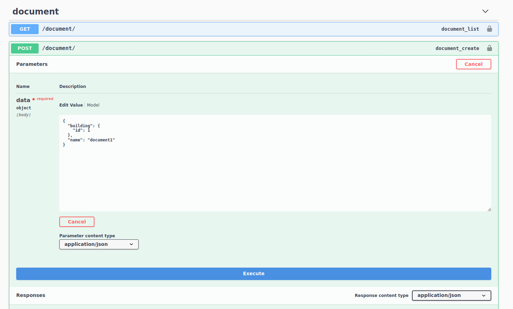
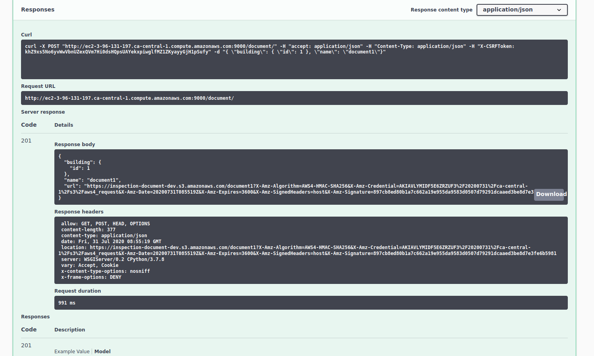
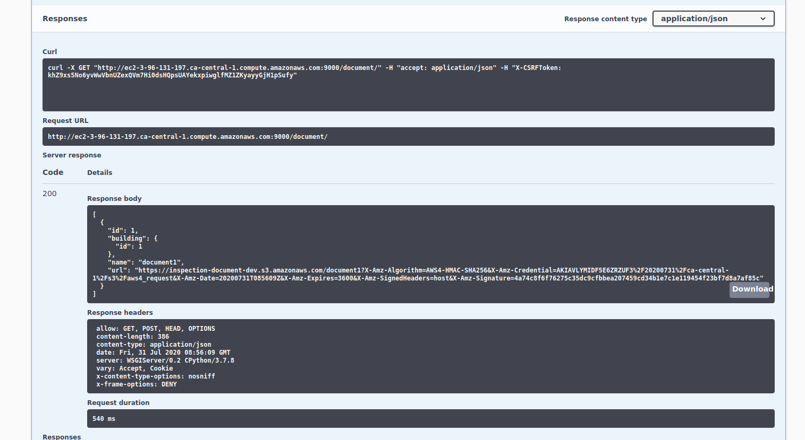

# building-inspection

## Functionality of the application

This application allows users to **create/remove/update/fetch/search** Building. 
It allows users to link **documents/metadata** to a building object.
Users can login/register.

## workflow

1- User should add a building.
2- User create a new document linked to that building using its id.
3- Application will respond with a PUT signed url, that can be used to upload the document to S3
4- When fetching all documents, Application will generate a GET signed url that can download the document.

## It is live, Try it:
[swagger link](http://ec2-3-96-131-197.ca-central-1.compute.amazonaws.com:9000/swagger/)


## How to run the application


To deploy an application run the following commands:

```
docker-compose up
```


## Postman collection

An alternative way to test your API, you can use the Postman collection that contains sample requests. You can find a Postman collection in this project. To import this collection, do the following.

Click on the import button:


Click on the "Choose Files":


Select a file to import:

Select the postman collection in the project files

## For creating document:

1- Set building id and the document name



2- Application will respond with a PUT signed url to upload the document to S3 bucket



3- When fetching all documents, Application will respond with a GET signed url to download the documents from S3 bucket




